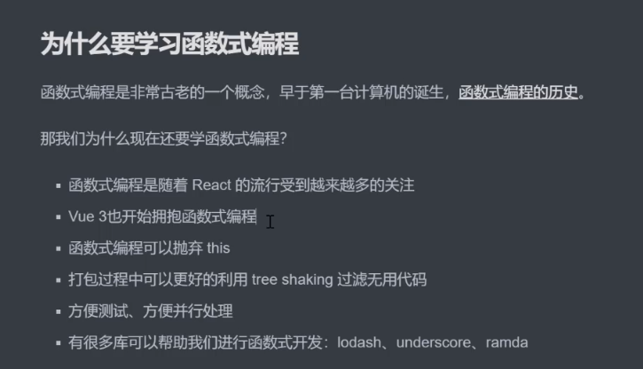
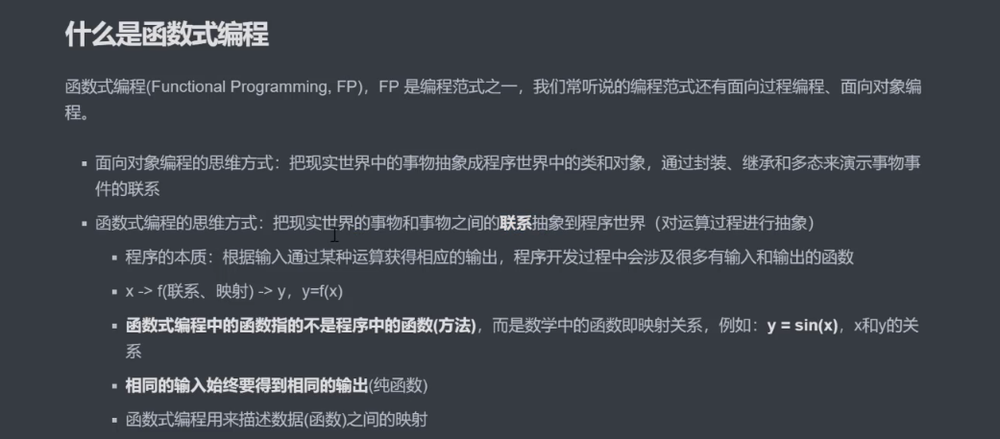
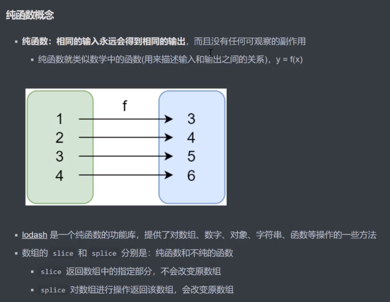
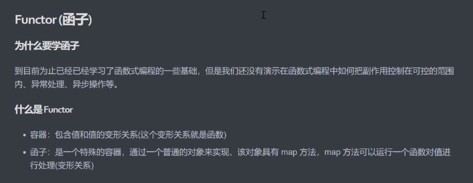
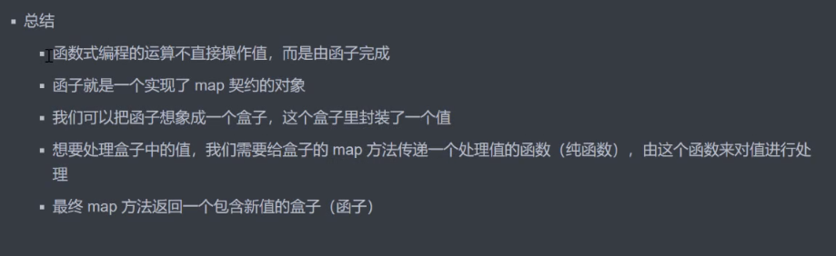

## 1、为什么学习函数式编程范式

### 1.1、为什么学习函数式编程




### 1.2、什么是函数式编程



```javascript
// 非函数式
let num1 = 2
let num2 = 3
let sum = num1 + num2
console.log(sum)

// 函数式
function add(n1, n2) {
    return n1 + n2
}
console.log(add(2, 3))
```


### 1.3、函数式一等公民

1. 函数可以作为参数传递
2. 函数可以作为返回值
3. 函数可以存储在变量中


### 1.4、高阶函数

- 可以把函数作为参数传递给另一个函数
- 可以把函数作为另一个函数的返回结果

```javascript
// 函数作为参数
function forEach(array, fn) {
    for(let i = 0;i < array.length;i++) {
        fn(array[i])
    }
}
let arr = [1,3, 4, 7, 8]
forEach(arr, function(item) {
    console.log(item)
})

// ---------------------------------------------------

function filter(array, fn) {
    let results = []
    for(let i = 0;i < array.length;i++) {
        if(fn(array[i])) {
            results.push(array[i])
        }
    }
    return results
}
let arr1 = [1, 3, 4, 7, 8]
let r = filter(arr1, function(item) {
    return item % 2 === 0
})
console.log(r)

// 函数作为返回值
function makeFn() {
    let msg = 'hello function'
    return function() {
        console.log(msg)
    }
}
const fn = makeFn()
fn()
makeFn()()

// ---------------------------------------------------

function once(fn) {
    let done = false
    return function() {
        if(!done) {
            done = true
            return fn.apply(this, arguments)
        }
    }
}
let pay = once(function(money) {
    console.log('pay:', money)
})
pay(5)
pay(5)
pay(5)
pay(5)
```


### 1.5、常用的高阶函数

- forEach
- map
- filter
- every
- some
- find/findIndex
- reduce
- sort
- ......

```
//map
const map = function(array, fn) {
    let results = []
    for(let value of array) {
        results.push(fn(value))
    }
    return results
}
let arr = [1, 2, 3, 4]
console.log(map(arr, v => v * v))

// every
const every = function(array, fn) {
    let result = true
    for(let value of array) {
        result = fn(value)
        if(!result) {
            break
        }
    }
    return result
}
console.log(every([9, 12, 14], v => v > 10))

// some
const some = (array, fn) => {
    let result = false
    for(let value of array) {
        if(fn(value)) {
            result = true
            break
        }
    }
    return result
}
console.log(some([1, 3, 6, 9], v => v % 2 === 0))
```


### 1.6、闭包

定义：函数和其周围的状态（词法环境）的引用捆绑在一起形成闭包

闭包可以在另一个作用域中调用一个函数的内部函数并访问到该函数的作用域中的成员

```javascript
// 闭包举例
function makeFn() {
    let msg = 'hello function'
    return function() {
        console.log(msg)
    }
}
const fn = makeFn()
fn()
```

**闭包的本质：** 函数在执行的时候会放到一个执行栈上，当函数执行完毕之后会从执行栈上一处，但是堆上的作用域成员因为被外部引用不能释放，因此内部函数依然可以访问外部函数的成员。

```javascript
// 案例
function makePower(power) {
    return function(number) {
        return Math.pow(number, power)
    }
}
let power2 = makePower(2)
let power3 = makePower(3)
console.log(power2(4))
console.log(power3(4))
```


### 1.7、纯函数和lodash



```
// 案例
// 纯函数
let array = [1, 2, 3, 4, 5]
console.log(array.slice(0, 3))  // [1, 2, 3]
console.log(array.slice(0, 3))  // [1, 2, 3]
console.log(array.slice(0, 3))  // [1, 2, 3]

// 不纯函数
console.log(array.splice(0, 3))  // [1, 2, 3]
console.log(array.splice(0, 3))  // [4, 5]
console.log(array.splice(0, 3))  // []
```

**纯函数优势：**

- 可缓存

```javascript
// 记忆函数
const _ = require('lodash')
function getArea(r) {
    console.log(r)				// 只执行1次
    return Math.PI * r * r
}
let getAreaWithMemory = _.memoize(getArea)
console.log(getAreaWithMemory(4))
console.log(getAreaWithMemory(4))
console.log(getAreaWithMemory(4))

// 模拟memoize
function memoize(fn) {
    let cache = {}
    return function() {
        let key = JSON.stringify(arguments)
        cache[key] = cache[key] || fn.apply(fn, arguments)
        return cache[key]
    }
}
let getAreaWithMemory = memoize(getArea)
console.log(getAreaWithMemory(4))
console.log(getAreaWithMemory(4))
console.log(getAreaWithMemory(4))
```

- 可测试
- 并行处理

```
1、在多线程环境下并行操作共享的内存数据很可能会出现意外情况
2、纯函数不需要访问共享的内存数据，所以在并行环境下可以任意运行纯函数（Web Worker）
```

**副作用来源：**

- 配置文件
- 全局变量
- 数据库
- 获取用户输入
- ......


### 1.8、柯里化

- 当一个函数有多个参数的时候先传递一部分参数调用它（这部分参数以后永远不变）
- 然后返回一个新的函数接收剩余的参数，返回结果

**lodash中的柯里化函数_.curry(func)**

```javascript
// 应用curry
const _ = require('lodash')
function getSum(a, b, c) {
    return a + b + c
}
const curried = _.curry(getSum)
console.log(curried(1, 2, 3))
console.log(curried(1)(2, 3))
console.log(curried(1, 2)(3))

// 案例
const _ = require('lodash')
const match = _.curry(function (reg, str) {
    return str.match(reg)
})

const haveSpace = match(/\s+/g)
console.log(haveSpace('hello world'))
const haveNumber = match(/\d+/g)
console.log(haveNumber('123abc'))

const filter = _.curry(function(func, array) {
    return array.filter(func)
})
console.log(filter(haveSpace, ['Hello World', 'Hello_World']))

const findSpace = filter(haveSpace)
console.log(findSpace(['Hello World', 'Hello_World']))

// 实现curry
function curry(func) {
    return function curriedFn(...args) {
        // 判断实参和形参的个数
        if(args.length < func.length) {
            return function() {
                return curriedFn(...args.concat(Array.from(arguments)))
            }
        }else {
            return func(...args)
        }
    }
}
function getSum(a, b, c) {
    return a + b + c
}
const curried = curry(getSum)
console.log(curried(1, 2, 3))
console.log(curried(1)(2, 3))
console.log(curried(1, 2)(3))
```


### 1.9、函数组合（compose）

- 纯函数和柯里化很容易写出洋葱代码`h(g(f(x)))`
- 函数组合可以让我们把细粒度的函数重新组合生成一个新的函数

```javascript
fn = compose(f1, f2, f3)
b = fn(a)
```

**函数组合默认是从右到左执行**

- lodash中的组合函数flow()或者flowRight()

```javascript
// flowright 实现
const compose = (...args) => value => args.reverse().reduce((acc, fn) => fn(acc), value)

const reverse = arr => arr.reverse()
const first = arr => arr[0]
const toUpper = s => s.toUpperCase()

const f = compose(toUpper, first, reverse)
console.log(f(['one', 'two', 'three']))
```

**函数组合遵循结合律， 如compose(fn1, fn2, fn3) 等价于 compose(compose(fn1, fn2), fn3) 等价于 compose(fn1, compose(fn2, fn3))**

lodash中的fp模块，函数中的参数先函数，后数据


### 1.10、Point Free编程风格

**定义：** 我们可以把数据处理的过程定义成与数据无关的合成运算，不需要用到代表数据的那个参数，只要把简单的运算步骤合成到一起，在使用这种模式之前我们需要定义一些辅助的基本运算函数。

- 不需要指明处理的数据
- 只需要合成运算过程
- 需要定义一些辅助的基本运算函数

```javascript
// Point Free
const fp = require('lodash/fp')
const f = fp.flowRight(fp.replace(/\s+/g, '_'), fp.toLower)
console.log(f('Hello     World'))

// 案例
const fp = require('lodash/fp')
// const firstLetterToUpper = fp.flowRight(fp.join('. '), fp.map(fp.first), fp.map(fp.toUpper), fp.split(' '))
const firstLetterToUpper = fp.flowRight(fp.join('. '), fp.map(fp.flowRight(fp.first, fp.toUpper)), fp.split(' '))
console.log(firstLetterToUpper('world wild web'))	// W. W. W.
```


### 1.11、函子



```javascript
// 函子
class Container {
    // Pointed函子（实现了of静态方法的函子）
    static of(value) {
        return new Container(value)
    }
    constructor(value) {
        this._value = value
    }
    map(fn) {
        return Container.of(fn(this._value))
    }
}
let r = new Container(5)
    .map(x => x + 1)
    .map(x => x * x)
console.log(r)

let r1 = Container.of(5)
    .map(x => x + 2)
    .map(x => x * x)
console.log(r1)
```




### 1.12、MayBe函子

- 我们在编程过程中可能会遇到很多错误，需要对这些错误做相应的处理
- MayBe函子的作用就是可以对外部的空值情况做处理（控制副作用在允许的范围）

```
// MayBe 函子
class MayBe {
    constructor(value) {
        this._value = value
    }

    static of(value) {
        return new MayBe(value)
    }

    map(fn) {
        return this.isNothing() ? MayBe.of(null) : MayBe.of(fn(this._value))
    }

    isNothing() {
        return this._value === null || this._value === undefined
    }
}
// let r = MayBe.of('Hello World')
//     .map(x => x.toUpperCase())
// let r = MayBe.of(null)
//     .map(x => x.toUpperCase())
let r = MayBe.of('Hello World')
    .map(x => x.toUpperCase())
    .map(x => null)
    .map(x => x.split(' '))
console.log(r)
```


### 1.13、Either函子

- Either两者中的任何一个，类似于if...else...的处理
- 异常会让函数便得不纯，Either函子可以用来做异常处理

```javascript
// Either函子
class Left {
    constructor(value) {
        this._value = value
    }

    static of(value) {
        return new Left(value)
    }

    map(fn) {
        return this
    }
}

class Right {
    constructor(value) {
        this._value = value
    }

    static of(value) {
        return new Right(value)
    }

    map(fn) {
        return Right.of(fn(this._value))
    }
}

// let r1 = Right.of(12).map(x => x + 2)
// let r2 = Left.of(12).map(x => x + 2)
// console.log(r1)
// console.log(r2)

function parseJSON(str) {
    try {
        return Right.of(JSON.parse(str))
    } catch(e) {
        return Left.of({error: e.message})
    }
}
// let r = parseJSON('{name: zhangsan}')
let r = parseJSON('{"name": "zhangsan"}')
            .map(x => x.name.toUpperCase())
console.log(r)
```


### 1.14、IO函子

- IO函子中得_value是一个函数，这里是把函数作为值来处理
- IO函子可以把不纯得动作存储到_value中，延迟执行这个不纯得操作（惰性执行），包装当前得操作纯
- 把不纯的操作交给调用者来处理

```javascript
// IO函子
const fp = require('lodash/fp')
class IO {
    constructor(fn) {
        this._value = fn
    }

    static of(value) {
        return new IO(function() {
            return value
        })
    }

    map(fn) {
        return new IO(fp.flowRight(fn, this._value))
    }
}
let r = IO.of(process).map(p => p.execPath)
console.log(r._value())
```


### 1.15、Folktale中的Task函子

```javascript
// Task函子
const fs = require('fs')
const { task } = require('folktale/concurrency/task')
const { split, find } = require('lodash/fp')
function readFile(filename) {
    return task(resolver => {
        fs.readFile(filename, 'utf-8', (err, data) => {
            if(err) resolver.reject(err)
            resolver.resolve(data)
        })
    })
}
readFile('package.json')
    .map(split('\n'))
    .map(find(x => x.includes('nodemon')))
    .run()
    .listen({
        onRejected: err => {
            console.log(err)
        },
        onResolved: value => {
            console.log(value)
        }
    })
```


### 1.16、Monad函子

- 是可以变扁的Pointed函子，IO(IO(x))
- 一个函子如果具有join和of两个方法并遵循一些定律就是一个Monad

```javascript
// IO Monad函子 解决函数嵌套问题
const fs = require('fs')
const fp = require('lodash/fp')

class IO {
    constructor(fn) {
        this._value = fn
    }

    static of(value) {
        return new IO(function() {
            return value
        })
    }

    map(fn) {
        return new IO(fp.flowRight(fn, this._value))
    }

    join() {
        return this._value()
    }

    flatMap(fn) {
        return this.map(fn).join()
    }
}

let readFile = function(filename) {
    return new IO(function() {
        return fs.readFileSync(filename, 'utf-8')
    })
}
let print = function(x) {
    return new IO(function() {
        return x
    })
}
let r = readFile('package.json')
            // .map(x => x.toUpperCase())
            // .map(fp.toUpper)
            .flatMap(print)
            .join()
console.log(r)
```


## 2、JavaScript性能优化


### 2.1、内存管理

- 定义
- 使用
- 释放


### 2.2、垃圾回收

- 引用、可达对象（引用、作用域链）
- 可达的标准是从根出发是否能够被找到


### 2.3、GC算法

- 引用计数
- 标记清除
- 标记整理
- 分代回收


### 2.4、引用计数

**设置引用数，判断当前引用数是否为0**

引用关系改变时修改引用数字

**优点：**

- 发现垃圾时立即回收
- 最大限度减少程序暂停

**缺点：**

- 无法回收循环引用的对象
- 时间开销大